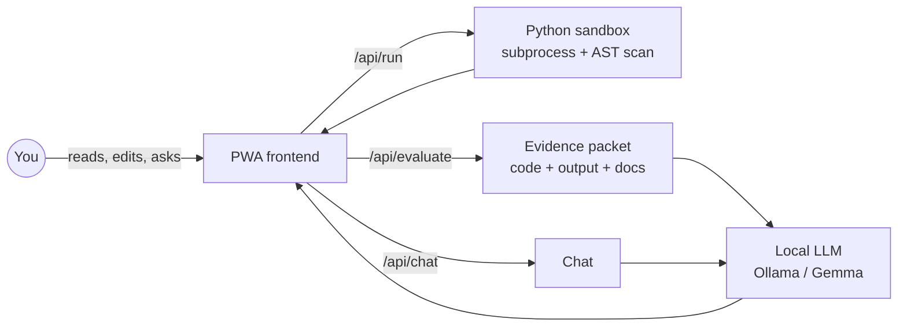
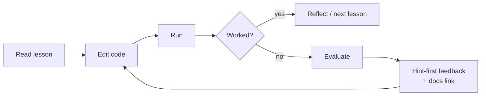

# Python Tutor

**A private, offline Python tutor that runs entirely on your own machine.**

Lessons, an interactive code lab, and an AI mentor — powered by a local LLM
(Gemma via Ollama). No accounts, no cloud, no telemetry. Open a browser, learn
Python, write code, get feedback. Your code and your questions never leave the
laptop.

```
┌─────────────────────────────────────────────────────────┐
│  Read a lesson  →  Run code in the lab  →  Ask tutor    │
│                       (all local, all offline)          │
└─────────────────────────────────────────────────────────┘
```

---

## Why it exists

| For…                       | It gives you                                                |
| -------------------------- | ----------------------------------------------------------- |
| **Self-learners**          | A guided Python curriculum with a chat tutor on demand.     |
| **Educators**              | A drop-in lab where students run code and get evidence-based hints. |
| **Privacy-minded teams**   | A tutor that works on an air-gapped laptop — nothing phones home. |
| **Tinkerers**              | A clean FastAPI + static-PWA stack to remix and extend.     |

---

## What you get

| Feature                       | What it does                                                                 |
| ----------------------------- | ---------------------------------------------------------------------------- |
| 🧠 **Local LLM tutor**        | Chat with a model running on your machine (default: `gemma3:4b` via Ollama). |
| 📓 **Lesson library**         | A PWA you can install, with a Python-foundations curriculum.                 |
| 🧪 **Inline code lab**        | Edit → **Run** → **Evaluate**. The tutor sees the real output, not a guess.  |
| ✅ **Graded exercises**        | Visible + hidden test cases, per-assertion pass/fail.                        |
| 📚 **Official docs links**    | Answers cite `docs.python.org` and friends from a curated allowlist — no hallucinated URLs. |
| 🛡 **Prototype-grade safety** | Static AST scan, isolated subprocess, timeouts, rlimits, scrubbed env.       |
| 🔌 **Works offline**          | UI runs without the LLM; only chat/evaluate need Ollama up.                  |

---

## How it works



The teaching loop:



The LLM teaches, explains, and guides. The **runtime** verifies — the tutor
never claims code works without running it.

---

## Quick start

Two commands. macOS or Linux. Python 3.10+.

```bash
gh repo clone StewAlexander-com/python-tutor
cd python-tutor
./install.sh        # sets up venv, then prompts y/N for any host-level step
./run.sh            # serves UI + API at http://localhost:8001/
```

Open <http://localhost:8001/> — you'll land on the lesson list with the code lab
and floating "Ask tutor" panel.

> `install.sh` only touches the repo on its own. **Installing Ollama, starting
> the daemon, pulling the model, or launching the app are all opt-in y/N
> prompts.** Press Enter and nothing changes on your host.

### Unattended install

```bash
TUTOR_NONINTERACTIVE=1 ./install.sh      # answer "no" to everything
PYTHON_TUTOR_ASSUME_YES=1 ./install.sh   # answer "yes" to everything (trusted hosts only)
TUTOR_SKIP_OLLAMA=1 ./install.sh         # skip all Ollama probes
```

Full list of env vars and the design rationale behind the two-script flow:
[`docs/install-runtime-workflow.md`](docs/install-runtime-workflow.md).

---

## Architecture at a glance

```
┌──────────────────────────┐      ┌──────────────────────────┐
│  frontend/  (static PWA) │◀────▶│  backend/  (FastAPI)     │
│  lesson list • code lab  │      │  /api/run /api/evaluate  │
│  floating chat FAB       │      │  /api/chat /api/exercises│
└──────────────────────────┘      └──────────┬───────────────┘
                                             │
                                             ▼
                                  ┌──────────────────────────┐
                                  │  Ollama (local LLM)      │
                                  │  default: gemma3:4b      │
                                  └──────────────────────────┘
```

| Layer                | Where it lives                          | Read more                                  |
| -------------------- | --------------------------------------- | ------------------------------------------ |
| Frontend (PWA)       | [`frontend/`](frontend/)                | [`frontend/README.md`](frontend/README.md) |
| Backend (FastAPI)    | [`backend/`](backend/)                  | [`backend/README.md`](backend/README.md)   |
| Curriculum & exercises | [`curriculum/`](curriculum/)          | [`curriculum/exercises/README.md`](curriculum/exercises/README.md) |
| Sandbox & safety     | [`backend/app/safety.py`](backend/app/safety.py) | [`docs/safety-and-sandboxing.md`](docs/safety-and-sandboxing.md) |
| Architecture         | —                                       | [`docs/architecture.md`](docs/architecture.md) |
| UX workflow          | —                                       | [`docs/ux-workflow.md`](docs/ux-workflow.md) |

---

## A word on safety

The sandbox is **prototype safety, not production isolation**. It is stronger
than a bare `subprocess.run`, but a local single-user tutor is its design
target — not a multi-tenant code execution service.

| In force                                                | Not in force                          |
| ------------------------------------------------------- | ------------------------------------- |
| Static AST scan (rejects `subprocess`, `socket`, `ctypes`, `pickle`, `os.system`, `exec`, `eval`, `__import__`, …) | Kernel-level isolation                |
| Isolated `python -I -B` subprocess, scrubbed env        | Defense against side-channel attacks  |
| Per-call tempdir at `0o700`, removed after run          | macOS `RLIMIT_AS` (Python ignores it) |
| Wall-clock timeout + process-group kill                 | Windows POSIX rlimits                 |
| POSIX rlimits: CPU, memory, file size, nproc            |                                       |
| Output truncation + code-size cap                       |                                       |

For multi-tenant or hostile workloads, wrap the runner in a container, a
microVM, or a restricted user. Details and threat model:
[`docs/safety-and-sandboxing.md`](docs/safety-and-sandboxing.md).

---

## Documentation citations

The tutor only cites **official Python docs from a curated allowlist** —
`docs.python.org`, `peps.python.org`, `packaging.python.org`, plus the official
sites for NumPy, pandas, Matplotlib, SciPy, Flask, FastAPI, Django, Requests,
HTTPX, SQLAlchemy, pytest, and mypy. URLs are **never generated by the LLM**:
they come from an in-repo map ([`backend/app/docs_refs.py`](backend/app/docs_refs.py))
or exercise-supplied references. When online, each link is HEAD-checked before
display; unreachable links are dropped or flagged "unverified".

---

## CI

GitHub Actions runs on every push and pull request: backend tests, a static
safety scan over the curriculum, and a Markdown link sanity check. See
[`.github/workflows/ci.yml`](.github/workflows/ci.yml).

---

## Going deeper

- [Architecture](docs/architecture.md)
- [Workflow](docs/workflow.md)
- [UX workflow](docs/ux-workflow.md)
- [Safety & sandboxing](docs/safety-and-sandboxing.md)
- [Evaluation](docs/evaluation.md)
- [Roadmap](docs/roadmap.md)
- [Install & runtime workflow](docs/install-runtime-workflow.md)
- [Python foundations curriculum](curriculum/python-foundations.md)
- [Tutor system prompt](prompts/tutor-system-prompt.md)
- [ADR 0001 — offline-first local LLM](adr/0001-offline-first-local-llm.md)

---

## Credits

The static PWA frontend was adapted from
[Python Power User](https://github.com/StewAlexander-com/Python-Power-User) (MIT).
