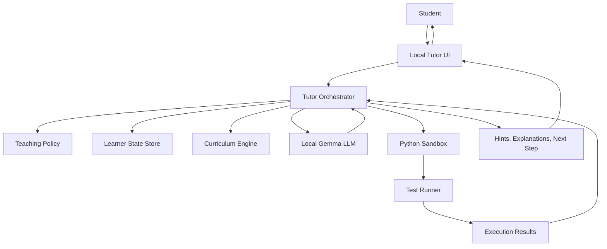
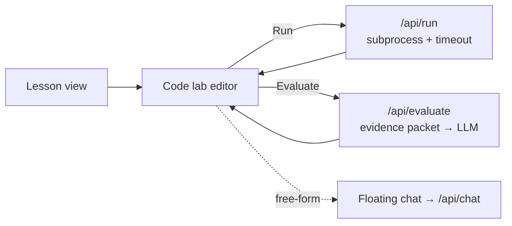
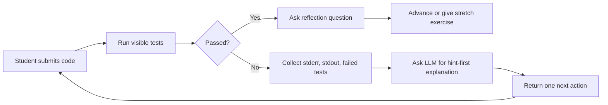

# Offline Python Tutor Framework

An offline-first framework for building a Python tutor powered by a local LLM such as Gemma, with deterministic code execution, test-based assessment, curriculum state, and privacy-preserving learner memory.

The central design rule is simple: the LLM teaches, explains, and guides, but the runtime verifies. The tutor should never rely on model confidence alone when it can run code, inspect errors, execute tests, or compare behavior against a rubric.

## Goals

- Provide a local Python learning assistant that works without cloud inference.
- Use a local LLM, such as Gemma through Ollama, llama.cpp, LM Studio, or Transformers.
- Give hint-first tutoring rather than answer-first completion.
- Verify student code with a sandboxed Python runner and test harness.
- Track learner progress locally using a small database or structured files.
- Support extensible curriculum modules, exercises, rubrics, and prompt policies.

## Non-goals

- Replacing a human instructor for all learning contexts.
- Trusting the LLM as the source of truth for code correctness.
- Running arbitrary student code without isolation, timeouts, and resource limits.
- Fine-tuning as a requirement for the MVP.

## System Overview



## Repository Map

```text
.
├── README.md
├── docs/
│   ├── architecture.md
│   ├── workflow.md
│   ├── safety-and-sandboxing.md
│   ├── evaluation.md
│   └── roadmap.md
├── curriculum/
│   └── python-foundations.md
├── prompts/
│   └── tutor-system-prompt.md
├── frontend/                 # static PWA frontend (see frontend/README.md)
│   ├── index.html
│   ├── app.js
│   ├── style.css
│   ├── base.css
│   ├── manifest.json
│   ├── sw.js
│   ├── content/sections.json
│   └── assets/
├── backend/                  # FastAPI tutor API (see backend/README.md)
│   ├── app/
│   ├── tests/
│   ├── requirements.txt
│   └── requirements-dev.txt
└── adr/
    └── 0001-offline-first-local-llm.md
```

## Running the Frontend

A static, dependency-free SPA lives in [`frontend/`](frontend/). It was adapted from the [Python Power User](https://github.com/StewAlexander-com/Python-Power-User) project (MIT) and provides the learner-facing UI for this framework.

```bash
cd frontend
python3 -m http.server 8000
# then open http://localhost:8000/
```

Any static HTTP server works. The app must be served over `http://` (not opened as a `file://` URL) so `fetch()` and the service worker can load `content/sections.json`. See [`frontend/README.md`](frontend/README.md) for routes, layout, and how to wire it up to the local LLM and sandbox backend.

## Running the Backend

A minimal FastAPI service in [`backend/`](backend/) proxies a local
Ollama-compatible LLM (default model: `gemma3:4b`) and exposes tutor-shaped
endpoints (`/api/health`, `/api/config`, `/api/chat`). Quick start:

```bash
# 1. Start Ollama and pull a model (one-time)
ollama serve &
ollama pull gemma3:4b

# 2. Install and run the backend
cd backend
python3 -m venv .venv
.venv/bin/pip install -r requirements.txt
.venv/bin/uvicorn app.main:app --host 127.0.0.1 --port 8001 --reload

# 3. In another shell, serve the frontend
cd frontend && python3 -m http.server 8000
```

Open <http://localhost:8000/> for the UI and <http://localhost:8001/docs> for
the auto-generated OpenAPI explorer. Override `OLLAMA_URL` and `TUTOR_MODEL`
to point at a different server or model. See [`backend/README.md`](backend/README.md)
for the full env-var reference, request/response shapes, and test instructions.

## End-to-End: Frontend + Backend + Ollama

The static PWA in [`frontend/`](frontend/) ships with an "Ask tutor" floating
chat panel ([`frontend/tutor-chat.js`](frontend/tutor-chat.js)) that talks to
the backend's `POST /api/chat`. There are two supported run modes.

### Mode A — single process (recommended for first run)

The backend serves the frontend directly. No CORS, no second port.

```bash
# 1. Ollama
ollama serve &
ollama pull gemma3:4b

# 2. Backend + frontend together
cd backend
python3 -m venv .venv
.venv/bin/pip install -r requirements.txt
TUTOR_SERVE_FRONTEND=1 .venv/bin/uvicorn app.main:app --host 127.0.0.1 --port 8001
```

Open <http://localhost:8001/> — the chat FAB appears bottom-right.

### Mode B — split static server and backend (developer-friendly)

Useful when iterating on frontend assets without reloading uvicorn.

```bash
# Terminal 1 — Ollama
ollama serve & ollama pull gemma3:4b

# Terminal 2 — backend on :8001 (CORS allows :8000 by default)
cd backend && .venv/bin/uvicorn app.main:app --host 127.0.0.1 --port 8001 --reload

# Terminal 3 — static frontend on :8000
cd frontend && python3 -m http.server 8000
```

Open <http://localhost:8000/>. The chat module auto-detects port `8001` when
served from `localhost:8000`. To point at a different backend, either edit the
`<meta name="tutor-backend">` tag in `frontend/index.html`, or run this once in
the browser console:

```js
localStorage.setItem('tutor-backend', 'http://my-host:8001');
location.reload();
```

The chat module reads (in order): `window.TUTOR_BACKEND_URL` → `<meta
name="tutor-backend">` → `localStorage["tutor-backend"]` → port heuristic →
same origin.

## UX Workflow — read · run · evaluate

Every section view now ends with an inline **code lab**: an editor seeded
with the section's example snippet, a **Run** button that executes the code
locally, and an **Evaluate** button that sends the code + the actual run
output to the tutor for evidence-based feedback. The floating chat panel
stays available for free-form questions.



The five candidate workflows considered, the trade-offs, and the chosen
blend (lesson-first spine + inline code-lab + evidence-packet evaluation)
are written up in [`docs/ux-workflow.md`](docs/ux-workflow.md).

### New backend endpoints

- `POST /api/run` — runs the submitted code in an isolated Python subprocess
  (`python -I`, empty env, temp cwd, hard wall-clock timeout, size-limited
  output). Returns `{stdout, stderr, exit_code, duration_ms, timed_out,
  truncated}`. This is **prototype safety only** — subprocess + timeout +
  restricted env. Not a real sandbox. See
  [`docs/safety-and-sandboxing.md`](docs/safety-and-sandboxing.md) for the
  controls a serious deployment would add (containers, seccomp, network
  namespaces, CPU/memory limits).
- `POST /api/evaluate` — accepts `{code, section?, question?, run_output?}`,
  runs the code if `run_output` is missing, builds an evidence packet, and
  asks the LLM for a hint-first assessment. Returns
  `{assessment, feedback, next_step, run, model}` where `assessment` is one
  of `passed | needs_work | error`.

Configurable via env: `TUTOR_RUN_TIMEOUT` (default 5s, clamped 0.5–30s),
`TUTOR_RUN_MAX_CODE_BYTES` (default 50 000), `TUTOR_RUN_MAX_OUTPUT_BYTES`
(default 32 000).

## Core Components

- **Tutor UI**: A local web app, terminal interface, or desktop shell where the student reads lessons, submits code, and receives feedback.
- **Tutor Orchestrator**: The control layer that decides when to call the LLM, when to run tests, when to ask a question, and when to advance the curriculum.
- **Local LLM Adapter**: A thin interface around Ollama, llama.cpp, LM Studio, or a local Transformers server.
- **Curriculum Engine**: A structured set of lessons, exercises, prerequisites, rubrics, and mastery criteria.
- **Python Sandbox**: A restricted execution environment for student code with timeouts, file controls, memory limits, and optionally network isolation.
- **Assessment Layer**: Unit tests, output checks, AST checks, and rubric scoring.
- **Learner State Store**: Local progress tracking for completed lessons, recurring mistakes, confidence, and next recommended exercises.

## Recommended MVP

Start with a terminal or lightweight web app. Avoid premature fine-tuning. Prompt a local Gemma model with a strong tutor policy, run student code in a constrained process, and use tests to ground the feedback.



## Minimal API Shape

```text
TutorSession
  - start_lesson(topic)
  - submit_code(code)
  - request_hint()
  - explain_error(error)
  - advance_when_mastered()

ModelAdapter
  - generate(messages, options)

SandboxRunner
  - run(code, timeout_seconds)
  - run_tests(code, tests, timeout_seconds)

CurriculumStore
  - get_lesson(id)
  - get_next_exercise(profile)
  - record_attempt(result)
```

## Example Local LLM Call

This framework assumes the app can call a local model server. For example, an Ollama-compatible adapter would POST to:

```text
http://localhost:11434/api/generate
```

The tutor should pass structured context:

```json
{
  "role": "system",
  "content": "You are a Python tutor. Teach with hints first. Do not solve the whole problem unless the learner asks."
}
```

## Teaching Loop

1. Select a lesson based on learner state.
2. Present a small concept and a constrained exercise.
3. Student submits code.
4. Sandbox runs the code and tests.
5. Orchestrator summarizes runtime evidence.
6. Local LLM generates a hint-first explanation.
7. Student revises.
8. System records progress and selects the next step.

## Safety Principles

- Run code with strict timeouts.
- Disable or heavily restrict filesystem access.
- Disable network access by default.
- Limit subprocess creation.
- Capture stdout, stderr, return code, and timeout state.
- Prefer containers, microVMs, or restricted users for serious deployments.
- Never let the LLM decide whether code is safe to execute.

## Development Milestones

- **M0: Design docs**: This repository.
- **M1: CLI prototype**: Local prompt, code submission, subprocess runner, basic tests.
- **M2: Curriculum prototype**: Foundations track with exercises and rubrics.
- **M3: Web UI**: Browser-based lesson flow and code editor.
- **M4: Learner memory**: Local SQLite state and personalized next-step selection.
- **M5: Hardening**: Container sandbox, security policy, telemetry-free local logs.
- **M6: Model comparison**: Compare Gemma variants and other local models for tutoring quality.

## Build Philosophy

Treat the tutor as a cyber-physical-ish feedback system: the LLM is a natural-language controller, the Python runtime is the measurement layer, tests are sensors, and the curriculum engine is the state machine. Keep subjective encouragement separate from objective evidence.

## Next Steps

Read:

- [Architecture](docs/architecture.md)
- [Workflow](docs/workflow.md)
- [Safety and Sandboxing](docs/safety-and-sandboxing.md)
- [Evaluation](docs/evaluation.md)
- [Roadmap](docs/roadmap.md)
- [Python Foundations Curriculum](curriculum/python-foundations.md)
- [Tutor System Prompt](prompts/tutor-system-prompt.md)
- [Frontend](frontend/README.md)
- [Backend](backend/README.md)
