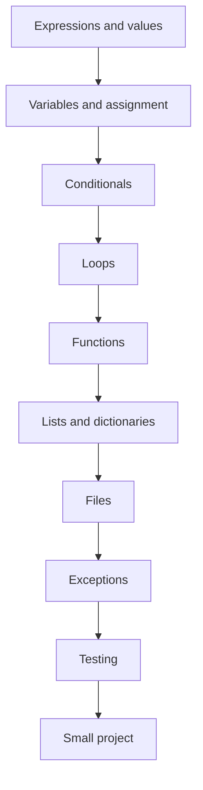

# Python Foundations Curriculum

This curriculum is designed for a tutor that teaches through short exercises, runtime evidence, and hint-first feedback.

## Track Map



## Lesson Schema

```yaml
id: loops.counting
title: Counting with loops
prerequisites:
  - variables.assignment
  - conditionals.basic_if
concepts:
  - for loops
  - counters
  - assignment
  - modulo
exercise:
  prompt: Count how many even numbers are in a list.
  starter_code: |
    def count_even(numbers):
        count = 0
        # your code here
        return count
visible_tests:
  - assert count_even([1, 2, 3, 4]) == 2
hidden_tests:
  - empty list
  - all odd numbers
  - all even numbers
mastery:
  pass_hidden_tests: true
  explain_concept: "Why does count += 1 change count?"
```

## Early Lessons

### Expressions and Values

Goal: distinguish values, operators, and expressions.

Example exercise:

```text
Write an expression that converts 72 Fahrenheit to Celsius.
```

Common mistakes:

- Confusing expression output with printed output.
- Integer division assumptions.
- Missing parentheses.

### Variables and Assignment

Goal: understand that assignment stores a value under a name.

Example exercise:

```text
Create variables for width and height, then compute area.
```

Common mistakes:

- Using `=` as equality.
- Expecting a variable to update automatically when another variable changes.
- Writing an expression without assigning it.

### Conditionals

Goal: branch based on boolean conditions.

Example exercise:

```text
Write a function that returns "adult" for age >= 18 and "minor" otherwise.
```

Common mistakes:

- Missing colon.
- Using assignment instead of comparison.
- Returning too early.

### Loops

Goal: repeat a block over a sequence.

Example exercise:

```text
Count strings longer than five characters.
```

Common mistakes:

- Forgetting to initialize accumulator.
- Forgetting to update accumulator.
- Off-by-one errors.
- Mutating a list while iterating.

### Functions

Goal: package behavior with inputs and outputs.

Example exercise:

```text
Write a function that returns the average of a list of numbers.
```

Common mistakes:

- Printing instead of returning.
- Not handling empty input.
- Variable scope confusion.

## Mastery Model

Each concept can be tracked using a simple scale:

| Score | Meaning |
|---|---|
| 0 | Not introduced |
| 1 | Introduced but fragile |
| 2 | Can solve with hints |
| 3 | Can solve independently |
| 4 | Can explain and transfer |

## Recommended First Project

Build a command-line habit tracker:

- Add a habit.
- Mark a habit complete.
- Show current streak.
- Save and load data from a file.

This project combines variables, conditionals, loops, functions, lists, dictionaries, files, and basic error handling.
