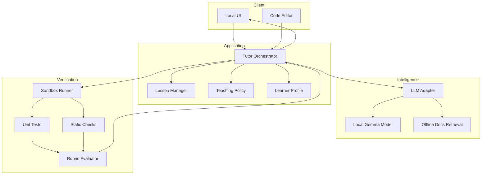
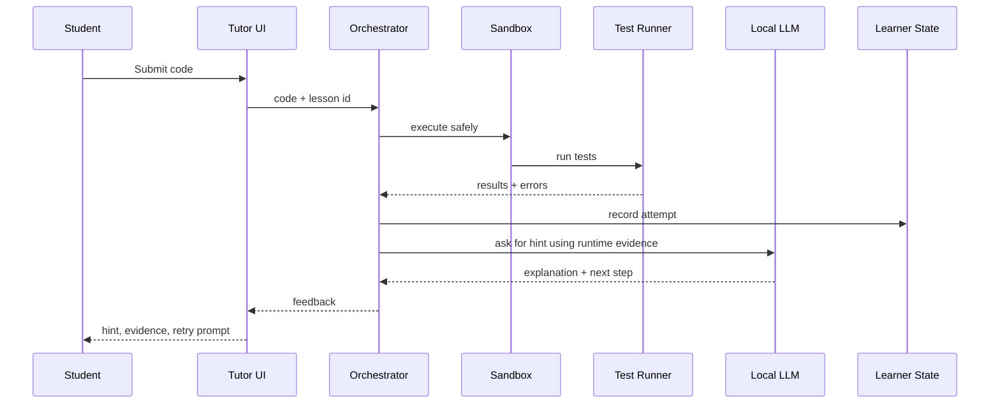

# Architecture

This document describes the system architecture for an offline Python tutor powered by a local LLM such as Gemma.

## Design Premise

The LLM should act as the tutor, not the judge. Code correctness should be evaluated by running code, executing tests, checking expected outputs, and inspecting structured signals. The LLM receives those signals and turns them into understandable feedback.

## Component Diagram



## Layers

### Interface Layer

The interface can be a CLI, a local web app, or a desktop app. The MVP should start with whichever path is fastest to build and debug. A web UI becomes useful once you want an embedded editor, visible test output, lesson navigation, and progress visualization.

### Orchestration Layer

The orchestrator is the control plane. It should be deterministic wherever possible. It chooses the current exercise, invokes the sandbox, prepares context for the LLM, applies the teaching policy, updates learner state, and decides whether mastery criteria have been met.

### Model Layer

The model adapter should hide the specific local inference backend. The application should not care whether the local model is served by Ollama, llama.cpp, LM Studio, vLLM, or a custom Transformers script.

Recommended adapter methods:

```text
generate(messages, temperature, max_tokens)
explain_error(context)
generate_hint(context)
generate_reflection_question(context)
```

### Verification Layer

The verification layer turns student code into evidence. Useful evidence includes:

- stdout
- stderr
- return code
- timeout state
- visible test results
- hidden test results
- static analysis findings
- syntax errors
- AST features used or missing

### State Layer

The state layer stores local learner history. This can start as JSON and later move to SQLite.

Suggested fields:

```text
learner_id
current_track
completed_lessons
attempt_history
recurring_errors
concept_mastery
preferred_hint_depth
last_session_summary
```

## Data Flow



## Local-First Deployment

The default deployment should run entirely on the learner's machine:

```text
localhost UI
localhost tutor service
localhost model server
local sandbox
local SQLite or JSON state
local curriculum files
```

This keeps learner code, mistakes, and progress private.

## Extension Points

- Additional models: Gemma, Llama, Qwen, Phi, Mistral, or custom fine-tuned variants.
- Additional tracks: Python foundations, data analysis, web APIs, testing, automation, cybersecurity scripting.
- Additional assessment: property-based tests, mutation testing, style checks, complexity checks.
- Additional interfaces: VS Code extension, Jupyter integration, browser IDE, mobile companion.
