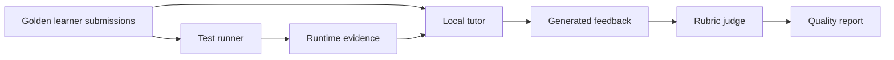

# Evaluation

Evaluation covers both code correctness and tutor quality.

## Code Correctness Evaluation

Use multiple signals:

- Syntax validation.
- Unit tests.
- Hidden tests.
- Expected stdout checks.
- Function return value checks.
- AST checks for required concepts.
- Regression tests for common mistakes.

## Tutor Quality Evaluation

The tutor should be evaluated as a teacher, not just as a chatbot.

Criteria:

- Gives hints before full answers.
- Uses runtime evidence correctly.
- Does not hallucinate test outcomes.
- Explains errors in beginner-friendly language.
- Adapts to recurring mistakes.
- Avoids excessive praise or vague encouragement.
- Encourages the learner to reason before copying.

## Golden Test Set

Create a set of learner submissions and expected tutoring behavior.

```yaml
- id: mutation_vs_expression
  prompt: Count even numbers in a list.
  code: |
    count = 0
    for n in numbers:
        if n % 2 == 0:
            count + 1
    return count
  expected_feedback:
    must_include:
      - "does not store"
      - "assignment"
    must_not_include:
      - full corrected solution
```

## Evaluation Flow



## Model Comparison

When comparing local models, hold the curriculum and test harness constant. Compare:

- Latency.
- Memory use.
- Hint quality.
- Error explanation accuracy.
- Tendency to provide full answers too early.
- Ability to follow the teaching policy.
- Stability across repeated runs.

## Human Review

Periodically review:

- Exercises where students get stuck.
- Tutor responses that produced confusion.
- False positives in static safety checks.
- False negatives in tests.
- Places where the model over-explained or under-explained.

## Success Metrics

Possible MVP metrics:

- Exercise completion rate.
- Attempts per completed exercise.
- Reduction in repeated error types.
- Time to first correct solution.
- Hint level needed before success.
- Learner self-rating before and after a lesson.
