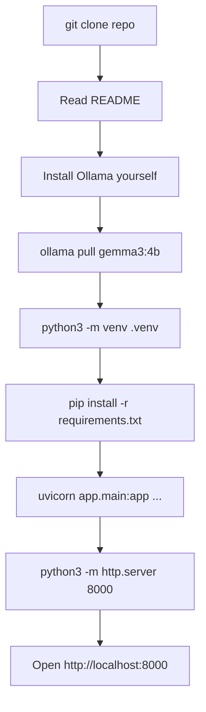
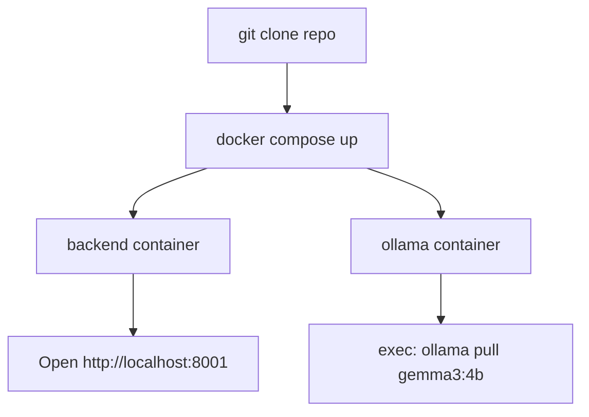
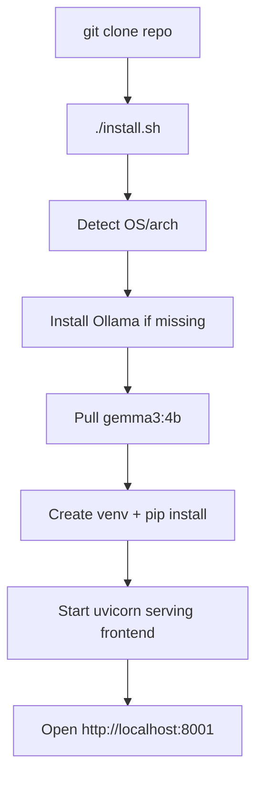
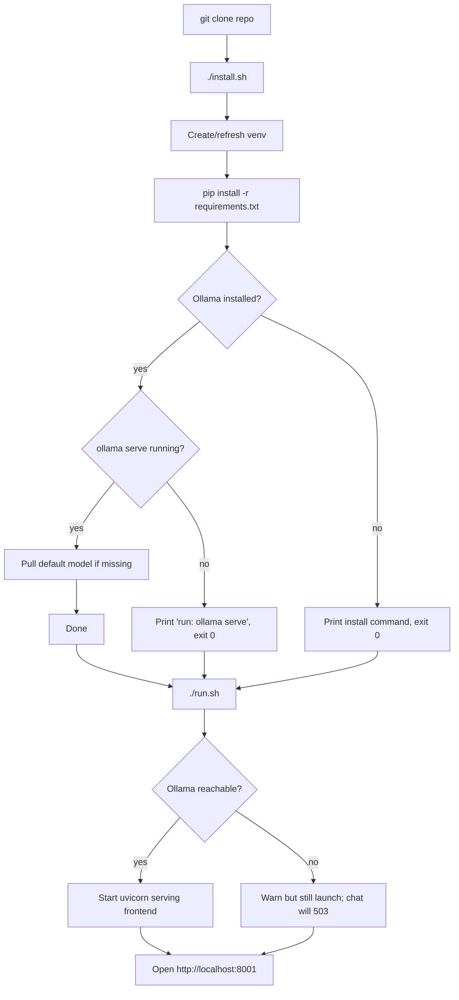
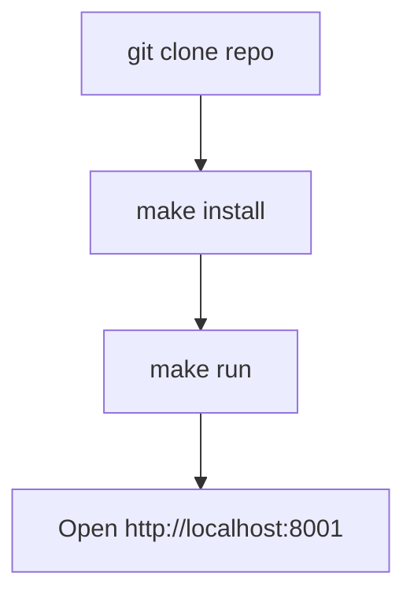

# Installation-to-Runtime Workflow

Goal: take a learner from `git clone` to a working Python-tutor web UI in
the browser with the fewest steps, the least human intervention, the
easiest cognitive load, and the lowest risk of mysterious failure.

The hard constraint: the tutor depends on a **local LLM** (Ollama by
default). We cannot ship Ollama itself — it must come from the host OS.
Anything we *can* automate, we automate; anything we *can't*, we surface
loudly with a single clear remediation line.

This document presents five candidate flows, evaluates them on the same
axes, and explains the blend that ships as `./install.sh` + `./run.sh`.

## Evaluation axes

- **Steps** — number of distinct commands the learner types.
- **Human intervention** — how many decisions or environment edits the
  user must make outside their terminal.
- **Ease** — cognitive load (one tool vs. many; one URL vs. many).
- **Risk** — likelihood of a silent-but-broken setup (e.g. Ollama not
  installed, wrong Python version, two terminals out of sync).

---

## Candidate A — Documented Manual Setup (status quo)

The README lists every command. The user runs them by hand.



- Steps: ~7
- Human intervention: high (multiple commands, two terminals, env vars)
- Ease: low — copy/paste discipline required
- Risk: high — easy to skip `ollama serve`, mix ports, or forget the
  `TUTOR_SERVE_FRONTEND=1` flag

## Candidate B — Docker / docker-compose

One image bundles backend + frontend; Ollama runs as a separate service.



- Steps: 2 (if Docker installed) + 1 model pull
- Human intervention: low *after* Docker is installed
- Ease: medium — Docker itself is a heavy prerequisite for many learners
- Risk: medium — GPU passthrough is finicky; Ollama-in-container loses
  Apple Silicon Metal acceleration

## Candidate C — One Big Bootstrap Script

A single `./install.sh` that installs Ollama (via Homebrew/curl), pulls
the model, creates the venv, installs deps, and launches everything.



- Steps: 1
- Human intervention: low — but the script touches the system (installs
  Ollama, may require sudo or Homebrew)
- Ease: high
- Risk: medium-high — installing system-level binaries on someone else's
  machine is invasive; failures here are confusing and hard to undo

## Candidate D — Two Scripts: install + run

Split responsibilities. `install.sh` is idempotent and never starts
servers. `run.sh` only starts the server. Ollama is *checked*, not
installed: if missing, the script prints exact installation instructions
and exits non-zero.



- Steps: 2 (`./install.sh` then `./run.sh`)
- Human intervention: low — install Ollama once, manually, with the
  exact line we print
- Ease: high — both scripts have a single, obvious purpose
- Risk: low — we never silently install system binaries; we never claim
  success if dependencies are missing; the UI still loads even without
  Ollama, so the user can read the lessons

## Candidate E — Make + targets

Same as D but driven by `make install`, `make run`, `make test`.



- Steps: 2
- Human intervention: low
- Ease: medium — assumes `make` is installed and the user is comfortable
  with Makefiles
- Risk: low

---

## Comparison table

| Flow | Steps | Intervention | Ease | Risk | Notes                                  |
| ---- | ----- | ------------ | ---- | ---- | -------------------------------------- |
| A    | ~7    | high         | low  | high | Status quo; easy to miss a step        |
| B    | 2     | low          | med  | med  | Docker prerequisite; loses Metal       |
| C    | 1     | low          | high | med+ | Invasive — installs system packages    |
| D    | 2     | low          | high | low  | Scripts check, never silently install  |
| E    | 2     | low          | med  | low  | Same as D, gated on `make` being there |

## Decision

We ship **Candidate D, blended with one ergonomic touch from C**.

- **From D**: two-script split (`install.sh`, `run.sh`); we *detect*
  Ollama rather than installing it; we never start daemons in
  `install.sh`; the run-time server still launches if Ollama is down so
  the UI is usable and the failure is observable in the chat panel.
- **From C**: in `install.sh`, if Ollama *is* present, we offer to
  `ollama pull` the default model on the user's behalf — gated by
  `TUTOR_SKIP_MODEL_PULL` and skippable in CI. Pulling a model the user
  already chose to have Ollama for is low-risk and saves a step.

This blend has:

- 2 commands typed (`./install.sh`, `./run.sh`) — same as B/D/E.
- Zero hidden system-level installs.
- One actionable error message if Ollama is missing (we print the
  install command for the user's platform).
- A web UI that loads even when the LLM is unreachable — so the learner
  always gets *something* to interact with.

## How the scripts behave

### `install.sh`

1. Detect Python ≥3.10. If missing or too old, print install command,
   exit 1.
2. Create `backend/.venv` if it doesn't exist; otherwise reuse it.
3. `pip install -r backend/requirements-dev.txt` (idempotent).
4. Check `ollama` on `PATH`. If missing, print install command and exit
   0 (success — the Python side is set up). User can re-run install
   later, or just run.
5. If `ollama` is present, probe `http://localhost:11434/api/tags`. If
   the daemon is up, pull the default model (skippable via
   `TUTOR_SKIP_MODEL_PULL=1`). If the daemon is down, print
   `ollama serve &` and continue.
6. Print next-step banner: `./run.sh`.

### `run.sh`

1. Ensure venv exists (re-run `install.sh` if not).
2. Probe Ollama; warn if unreachable but continue.
3. Launch uvicorn with `TUTOR_SERVE_FRONTEND=1` so the backend serves
   the static frontend on the same port.
4. Print the URL: `http://localhost:8001/`.

### Environment overrides

- `TUTOR_PORT` — backend port (default 8001).
- `TUTOR_HOST` — bind address (default 127.0.0.1).
- `TUTOR_MODEL` — Ollama model tag (default `gemma3:4b`).
- `TUTOR_SKIP_OLLAMA=1` — skip every Ollama probe (CI/offline-dev).
- `TUTOR_SKIP_MODEL_PULL=1` — skip `ollama pull` in install.
- `TUTOR_NONINTERACTIVE=1` — never prompt; assume defaults.

## What the user does

```bash
gh repo clone StewAlexander-com/python-tutor
cd python-tutor
./install.sh        # ~2 min cold; reuses cache on re-run
./run.sh            # opens at http://localhost:8001/
```

If Ollama is missing, `install.sh` will tell them exactly what to type:

```bash
# macOS
brew install ollama && ollama serve &

# Linux
curl -fsSL https://ollama.com/install.sh | sh && ollama serve &
```

Then `./install.sh && ./run.sh` again.
