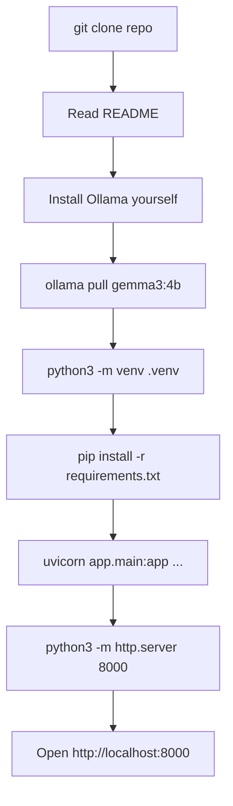
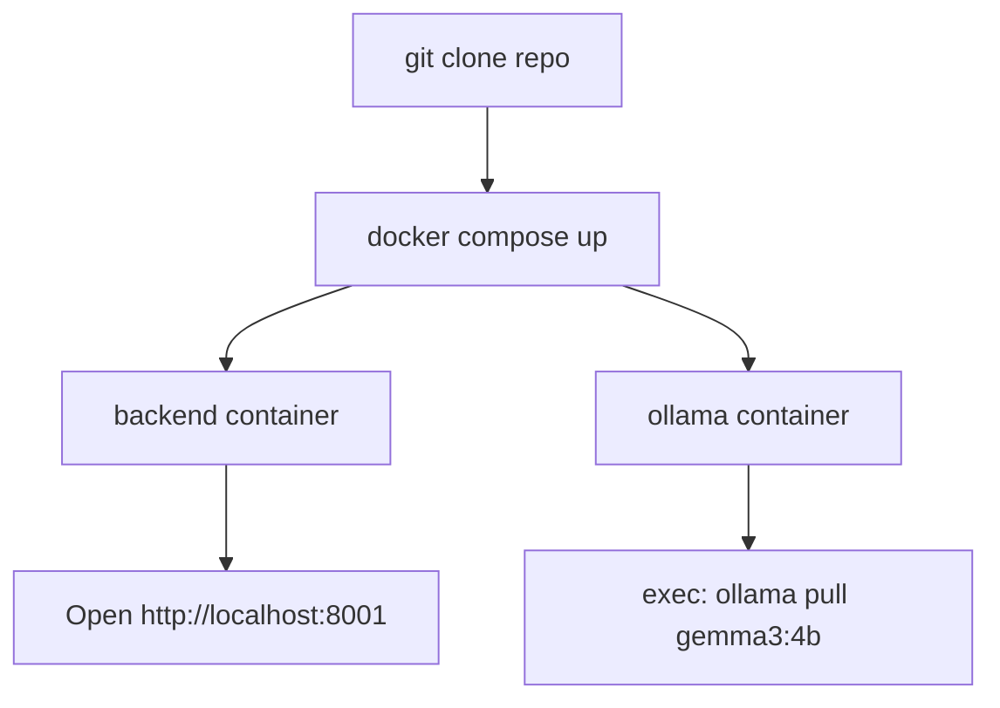
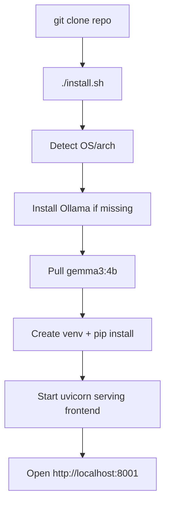
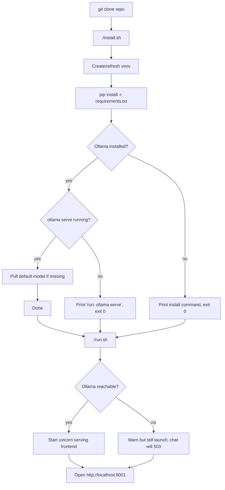
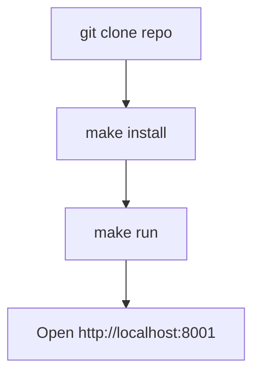
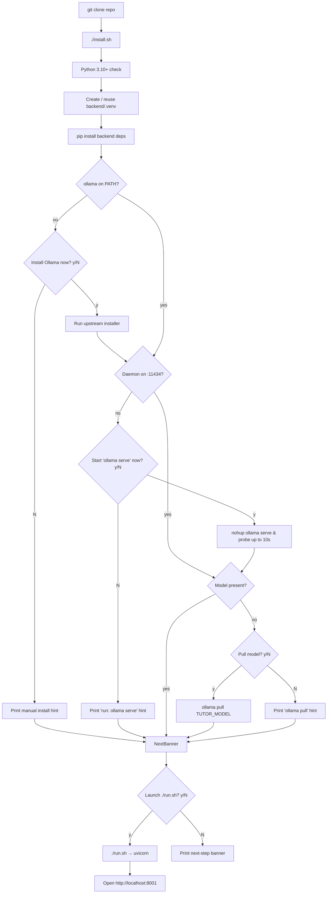

# Installation-to-Runtime Workflow

Goal: take a learner from `git clone` to a working Python-tutor web UI in
the browser with the fewest steps, the least human intervention, the
easiest cognitive load, and the lowest risk of mysterious failure.

The hard constraint: the tutor depends on a **local LLM** (Ollama by
default). We cannot ship Ollama itself — it must come from the host OS.
Anything we *can* automate, we automate; anything we *can't*, we surface
loudly with a single clear remediation line.

This document presents five candidate flows, evaluates them on the same
axes, and explains the blend that ships as `./install.sh` + `./run.sh`.

## Evaluation axes

- **Steps** — number of distinct commands the learner types.
- **Human intervention** — how many decisions or environment edits the
  user must make outside their terminal.
- **Ease** — cognitive load (one tool vs. many; one URL vs. many).
- **Risk** — likelihood of a silent-but-broken setup (e.g. Ollama not
  installed, wrong Python version, two terminals out of sync).

---

## Candidate A — Documented Manual Setup (status quo)

The README lists every command. The user runs them by hand.



- Steps: ~7
- Human intervention: high (multiple commands, two terminals, env vars)
- Ease: low — copy/paste discipline required
- Risk: high — easy to skip `ollama serve`, mix ports, or forget the
  `TUTOR_SERVE_FRONTEND=1` flag

## Candidate B — Docker / docker-compose

One image bundles backend + frontend; Ollama runs as a separate service.



- Steps: 2 (if Docker installed) + 1 model pull
- Human intervention: low *after* Docker is installed
- Ease: medium — Docker itself is a heavy prerequisite for many learners
- Risk: medium — GPU passthrough is finicky; Ollama-in-container loses
  Apple Silicon Metal acceleration

## Candidate C — One Big Bootstrap Script

A single `./install.sh` that installs Ollama (via Homebrew/curl), pulls
the model, creates the venv, installs deps, and launches everything.



- Steps: 1
- Human intervention: low — but the script touches the system (installs
  Ollama, may require sudo or Homebrew)
- Ease: high
- Risk: medium-high — installing system-level binaries on someone else's
  machine is invasive; failures here are confusing and hard to undo

## Candidate D — Two Scripts: install + run

Split responsibilities. `install.sh` is idempotent and never starts
servers. `run.sh` only starts the server. Ollama is *checked*, not
installed: if missing, the script prints exact installation instructions
and exits non-zero.



- Steps: 2 (`./install.sh` then `./run.sh`)
- Human intervention: low — install Ollama once, manually, with the
  exact line we print
- Ease: high — both scripts have a single, obvious purpose
- Risk: low — we never silently install system binaries; we never claim
  success if dependencies are missing; the UI still loads even without
  Ollama, so the user can read the lessons

## Candidate E — Make + targets

Same as D but driven by `make install`, `make run`, `make test`.



- Steps: 2
- Human intervention: low
- Ease: medium — assumes `make` is installed and the user is comfortable
  with Makefiles
- Risk: low

---

## Comparison table

| Flow | Steps | Intervention | Ease | Risk | Notes                                  |
| ---- | ----- | ------------ | ---- | ---- | -------------------------------------- |
| A    | ~7    | high         | low  | high | Status quo; easy to miss a step        |
| B    | 2     | low          | med  | med  | Docker prerequisite; loses Metal       |
| C    | 1     | low          | high | med+ | Invasive — installs system packages    |
| D    | 2     | low          | high | low  | Scripts check, never silently install  |
| E    | 2     | low          | med  | low  | Same as D, gated on `make` being there |

## Decision

We ship **Candidate D, blended with the consent-gated ergonomics of C**.

- **From D**: two-script split (`install.sh`, `run.sh`); we *detect*
  Ollama and the model rather than installing them silently; the
  run-time server still launches if Ollama is down so the UI is usable
  and the failure is observable in the chat panel.
- **From C**: when something host-level is missing — the Ollama binary,
  the `ollama serve` daemon, or the default model — `install.sh`
  *offers* to handle it. The user types `y` to accept. The default
  answer is **no**, so pressing Enter never installs a system binary.

This blend has:

- 2 commands typed (`./install.sh`, `./run.sh`) — same as B/D/E.
- Zero hidden system-level installs. Every system-touching action is
  preceded by an explicit y/N confirmation.
- A single non-interactive entry-point for CI
  (`TUTOR_NONINTERACTIVE=1` defaults all prompts to "no";
  `PYTHON_TUTOR_ASSUME_YES=1` defaults them to "yes" for pre-approved
  unattended setup).
- A web UI that loads even when the LLM is unreachable — so the learner
  always gets *something* to interact with.



## How the scripts behave

### `install.sh`

1. Detect Python ≥3.10. If missing or too old, print install command,
   exit 1.
2. Create `backend/.venv` if it doesn't exist; otherwise reuse it.
3. `pip install -r backend/requirements-dev.txt` (idempotent;
   not gated by a prompt — those changes live inside the repo).
4. Check `ollama` on `PATH`. If missing, **prompt** to install via the
   OS-appropriate upstream installer (`brew install ollama` on macOS,
   `curl https://ollama.com/install.sh | sh` on Linux). Decline and
   the script prints the manual command and continues.
5. If `ollama` is present, probe `http://localhost:11434/api/tags`.
   If the daemon is down, **prompt** to start `ollama serve` in the
   background (`nohup`, logged to `/tmp/ollama-serve.log`).
6. If the daemon is up, check for the model
   (`TUTOR_MODEL`, default `gemma3:4b`). If absent, **prompt** to
   `ollama pull` it.
7. After setup, **prompt** "Launch the tutor now (./run.sh)?".
   `PYTHON_TUTOR_AUTOLAUNCH=1` or `PYTHON_TUTOR_ASSUME_YES=1` answers
   yes without asking.

### `run.sh`

1. Ensure venv exists (re-run `install.sh` in non-interactive,
   skip-Ollama mode if not — this never installs system binaries).
2. Probe Ollama; if installed but the daemon is down, **prompt** to
   start `ollama serve`. If declined, warn and continue.
3. Launch uvicorn with `TUTOR_SERVE_FRONTEND=1` so the backend serves
   the static frontend on the same port.
4. Print the URL: `http://localhost:8001/`.

### Environment overrides

- `TUTOR_PORT` — backend port (default 8001).
- `TUTOR_HOST` — bind address (default 127.0.0.1).
- `TUTOR_MODEL` — Ollama model tag (default `gemma3:4b`).
- `TUTOR_SKIP_OLLAMA=1` — skip every Ollama probe (CI/offline-dev).
- `TUTOR_SKIP_MODEL_PULL=1` — skip `ollama pull` in install.
- `TUTOR_NONINTERACTIVE=1` — never prompt; auto-answer **no**.
- `PYTHON_TUTOR_NONINTERACTIVE=1` — alias for the above.
- `PYTHON_TUTOR_ASSUME_YES=1` — never prompt; auto-answer **yes**.
- `PYTHON_TUTOR_AUTOLAUNCH=1` — `exec ./run.sh` after install
  without asking.

## What the user does

Default interactive flow:

```bash
gh repo clone StewAlexander-com/python-tutor
cd python-tutor
./install.sh        # ~2 min cold; prompts y/N for each system action
                    # answer 'y' to install Ollama, start the daemon,
                    # pull the model, and launch the app
```

If you'd rather drive it yourself, decline every prompt and the script
still finishes successfully — only the Python side is set up, with
clear hints for what to run next.

Unattended:

```bash
# Pre-approved: install Ollama, start it, pull the model, exec run.sh.
PYTHON_TUTOR_ASSUME_YES=1 ./install.sh
# (or, equivalently:)
./install.sh --yes

# CI: do not touch Ollama at all.
TUTOR_SKIP_OLLAMA=1 TUTOR_NONINTERACTIVE=1 ./install.sh
./install.sh --noninteractive --skip-ollama --skip-model-pull --no-launch
```

## CLI flags

Both scripts now accept flags in addition to env vars. Run
`./install.sh --help` or `./run.sh --help` for the full list. The flags
are sugar over the same env vars; existing CI invocations keep working.

| Flag                       | Equivalent env var               |
| -------------------------- | -------------------------------- |
| `-y`, `--yes`              | `PYTHON_TUTOR_ASSUME_YES=1`      |
| `-n`, `--noninteractive`   | `TUTOR_NONINTERACTIVE=1`         |
| `--no-launch`              | (install) suppresses launch prompt; (run) preflight-only dry run |
| `--skip-ollama`            | `TUTOR_SKIP_OLLAMA=1`            |
| `--skip-model-pull`        | `TUTOR_SKIP_MODEL_PULL=1`        |
| `--model TAG`              | `TUTOR_MODEL=TAG`                |
| `--host ADDR` (run only)   | `TUTOR_HOST=ADDR`                |
| `--port N` (run only)      | `TUTOR_PORT=N`                   |
| `--open-browser` (run only) | (no env equivalent; opt-in)     |

Exit codes:

- `install.sh`: `0` ok, `1` Python too old/missing, `2` pip failed, `3`
  invalid CLI args.
- `run.sh`: `0` ok (server started, or `--no-launch` dry-run), `3`
  invalid CLI args, `4` port already in use.

## Offline / restricted networks

`install.sh` calls `pip install` against PyPI by default. When the host
cannot reach `pypi.org` (corporate proxy, air-gapped lab, flaky DNS) the
script captures pip's stderr and prints actionable hints. Three
documented paths:

1. **Behind a proxy:** export `HTTPS_PROXY` / `HTTP_PROXY` and re-run.
2. **Internal mirror:** `PIP_INDEX_URL=https://pypi.internal/simple ./install.sh`.
3. **Air-gapped:** build a wheelhouse on a connected host, then point
   pip at the local directory and skip the index:

   ```bash
   # on a connected host:
   pip download -d wheelhouse -r backend/requirements-dev.txt
   # rsync wheelhouse/ to the target, then:
   PIP_NO_INDEX=1 PIP_FIND_LINKS="$PWD/wheelhouse" ./install.sh
   ```

The detailed audit (failure modes seen in real installs and the
mitigations now in the scripts) lives at
[`install-audit.md`](install-audit.md).

## Venv path sensitivity

Python virtualenvs hard-code their absolute path inside
`pyvenv.cfg` and the shebangs of `bin/*`. Moving or copying a venv
silently breaks it. `install.sh` writes the repo path to
`backend/.venv/.tutor_repo_root` and on subsequent runs rebuilds the
venv if the repo has moved. The takeaway: choose your install location
before running `./install.sh`. If you must move the repo, re-run
`./install.sh` from the new location.
