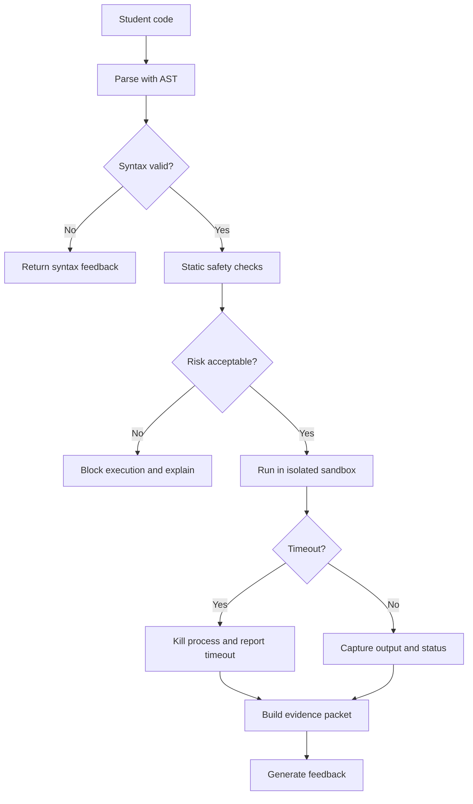

# Safety and Sandboxing

Student code execution is the highest-risk part of the system. The LLM should never be trusted to decide whether untrusted code is safe.

## Threat Model

Student code may accidentally or intentionally:

- Delete or overwrite files.
- Read private files.
- Spawn long-running processes.
- Allocate excessive memory.
- Enter infinite loops.
- Use network access.
- Execute shell commands.
- Abuse imports.
- Attempt sandbox escape.

## Minimum Safety Controls

For a prototype:

- Run each submission in a separate process.
- Apply a strict timeout.
- Capture stdout and stderr.
- Use a temporary working directory.
- Avoid passing secrets through environment variables.
- Block or inspect dangerous imports before execution.
- Limit output size.

For a serious local app:

- Run code in a container, microVM, or restricted OS user.
- Disable network access by default.
- Mount a temporary filesystem.
- Apply CPU and memory limits.
- Use seccomp, AppArmor, or equivalent controls where available.
- Destroy the environment after each run.

## Safety Flow



## Dangerous Patterns to Flag

Initial static checks can flag:

```text
import os
import subprocess
import socket
import pathlib
open("/Users/...")
while True
eval(...)
exec(...)
__import__(...)
```

These checks are not sufficient by themselves. They are early warning sensors, not the sandbox.

## Recommended Execution Contract

Every code execution should return:

```yaml
status: passed | failed | blocked | timeout | error
stdout: string
stderr: string
return_code: integer
duration_ms: integer
test_results:
  passed: integer
  failed: integer
  failures: list
safety_events:
  - type: blocked_import
    detail: subprocess
```

## LLM Boundary

The LLM may:

- Explain why code was blocked.
- Suggest safer alternatives.
- Explain test failures.
- Generate exercises.
- Ask diagnostic questions.

The LLM must not:

- Override sandbox policy.
- Execute code directly.
- Receive private local files unless explicitly selected.
- Reveal hidden tests.
- Encourage disabling safety controls.
