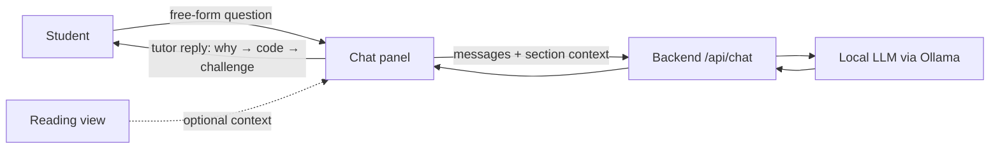
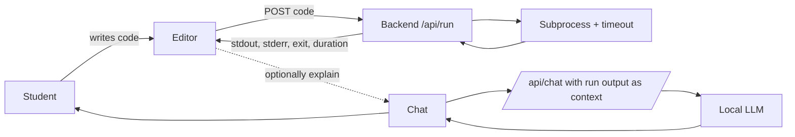
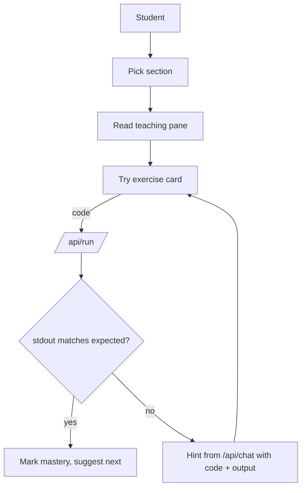
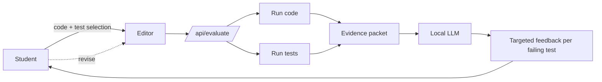
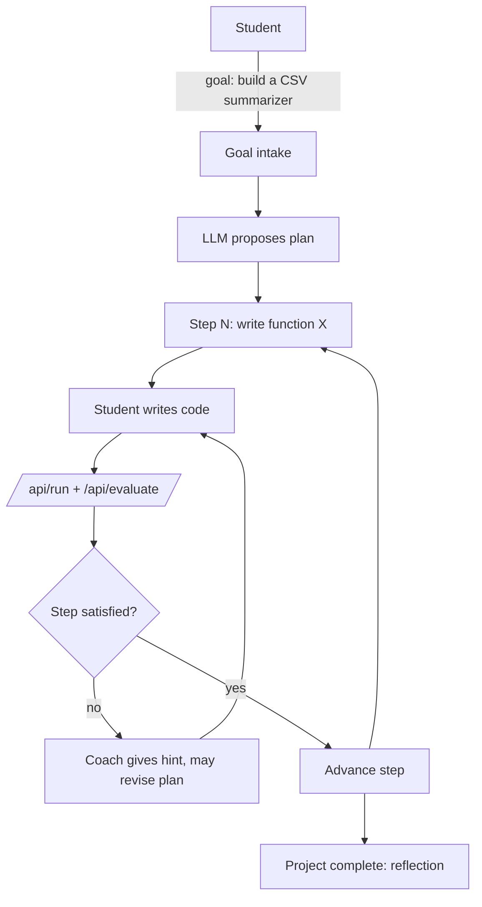
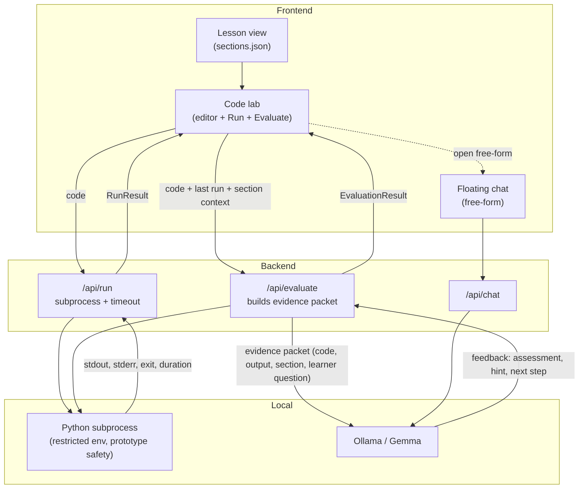

# UX Workflow — Input → Output Models

This document explores five candidate interaction models for the Offline Python
Tutor, evaluates them against the project's design foundations (local-first,
restrained UI, accessible, purpose-driven, hint-first pedagogy), and selects a
blended target workflow that the current iteration builds toward.

The five candidates are deliberately distinct so the trade-offs are visible.
They are not strawmen — each one is a plausible product on its own.

---

## Candidate A — Chat-first

A floating chat panel is the primary surface. Lessons sit behind it as
optional reading material. The student types a question, the tutor answers.

**Strengths.** Minimal new surface area; reuses today's chat module. Works
without code execution. Low friction.

**Weaknesses.** No runtime evidence — the LLM is the only judge of
correctness, which the architecture doc explicitly warns against
(`docs/architecture.md`: "the LLM should act as the tutor, not the judge").
Easy for the student to drift into copy-paste.

---

## Candidate B — Code-lab-first

The primary surface is an editor + run pane. The student writes code, presses
**Run**, sees stdout/stderr, then optionally asks the tutor about the result.

**Strengths.** Runtime evidence first — matches the architecture's "code
correctness is decided by running code." Cheap to validate.

**Weaknesses.** Pedagogy is reactive. The student needs to know *what* to
write before the tutor enters. Beginners stall.

---

## Candidate C — Lesson-first (reading-led)

A guided reading flow. Each section ends with a prompt: an exercise card, an
inline code field, and a **Check** button. Chat is secondary, accessed from
the lesson context.

**Strengths.** Strong pedagogical scaffolding. Matches the existing
`content/sections.json` structure. Tutor only enters when needed, with
runtime evidence already attached.

**Weaknesses.** Heavier UI build (per-section exercise schema, expected
outputs, mastery rules). Restricts the student to a curated path.

---

## Candidate D — Test-feedback loop

The student submits code against a visible test set. Results are structured
(per-test pass/fail). The LLM explains failures using the structured packet.

**Strengths.** Closest to the architecture's "evidence packet" idea
(`docs/workflow.md`). LLM never claims a test passed without runtime proof.
Easy to score mastery.

**Weaknesses.** Requires authored test sets per exercise. Heavier content
authoring burden. Risk of feeling like a homework grader.

---

## Candidate E — Agentic project coach

The tutor acts as a coach across a multi-step project. It proposes next
steps, the student accepts or rewrites, and the tutor checks the workspace.

**Strengths.** Highest engagement; closest to real-world software work.
Stretches across the whole curriculum.

**Weaknesses.** Largest scope. Needs plan state, project workspace, multi-file
support, and trustworthy plan revision. Premature for the current iteration.

---

## Evaluation

| Criterion | A Chat | B Code-lab | C Lesson | D Test-loop | E Agent |
|---|---|---|---|---|---|
| Honors "LLM is tutor, not judge" | ✗ | ✓ | ✓ | ✓ | ✓ |
| Works with today's content (`sections.json`) | ✓ | partial | ✓ | needs tests | ✗ |
| Build cost this iteration | low | low | medium | medium-high | high |
| Local-first / offline-safe | ✓ | ✓ | ✓ | ✓ | ✓ |
| Restrained UI surface | ✓ | medium | medium | medium | crowded |
| Accessibility (keyboard, screen reader) | ✓ | ✓ | ✓ | ✓ | hard |
| Beginner on-ramp | medium | weak | strong | medium | weak |
| Runtime evidence drives feedback | ✗ | ✓ | ✓ | ✓ | ✓ |

No single candidate dominates. A wins on simplicity but fails the core
pedagogical constraint. E is the most ambitious but its scope is wrong for
this milestone. B, C, and D each carry part of the answer.

## Chosen target — blended (C + B with a D-shaped feedback step)

The selected workflow keeps the existing **lesson-first** reading as the
spine (Candidate C), adds an **inline code lab** to every section
(Candidate B's editor + Run), and routes a single **Evaluate** action through
a small evidence packet to the LLM in the shape Candidate D recommends. The
floating chat from PR #3 stays available as the free-form escape hatch.

The result is one surface, one mental model:

> *Read a section → try the suggested code → Run it to see what actually
> happens → press Evaluate to ask the tutor "did I get this right, and what
> should I do next?"*

### Why this blend

- **Lesson stays the spine** — students keep the curated path they already
  have, the chat module already references section context, and no content
  re-authoring is required to ship value.
- **Run before Evaluate** — the student always sees raw runtime output
  before the LLM speaks. This is the architectural rule "code correctness
  is decided by running code," enforced at the UI level.
- **One Evaluate endpoint, one evidence packet** — matches
  `docs/workflow.md`'s evidence-packet design. Keeps prompts terse and
  testable; the LLM is given facts, not asked to invent them.
- **Chat remains** — the free-form escape hatch from PR #3 is not removed.
  It is the right surface for "explain this concept" questions that do not
  have code attached.
- **Safety is honest** — `docs/safety-and-sandboxing.md` calls out that the
  minimum prototype controls are subprocess + timeout + restricted env.
  That is exactly what `/api/run` implements; the UI surfaces this as
  "prototype safety, not production sandboxing."

### What this iteration ships

1. `POST /api/run` — execute student code in a subprocess with a hard
   timeout, captured stdout/stderr, restricted env (no inherited
   `PYTHONPATH`, no network helpers passed in), and a size-limited output.
2. `POST /api/evaluate` — accept `{code, output?, section?, question?}`,
   optionally re-run the code, build an evidence packet, call the LLM,
   return structured feedback (`assessment`, `feedback`, `next_step`).
3. Code lab in the section view — collapsible editor + Run + Evaluate +
   results panel; reuses chat panel design tokens.
4. Chat already integrates section context; gets a small "include last
   run" affordance.
5. Tests for both new endpoints and a JS syntax check for the new module.

### Explicitly out of scope (parked for later)

- Per-exercise expected-output tests (full Candidate D).
- Multi-file project workspace (Candidate E).
- Mastery state and learner profile persistence.
- Streaming responses for `/api/evaluate`.
- True isolation (containers, microVMs, seccomp). The current `/api/run`
  is **prototype safety only** and the docs say so.
