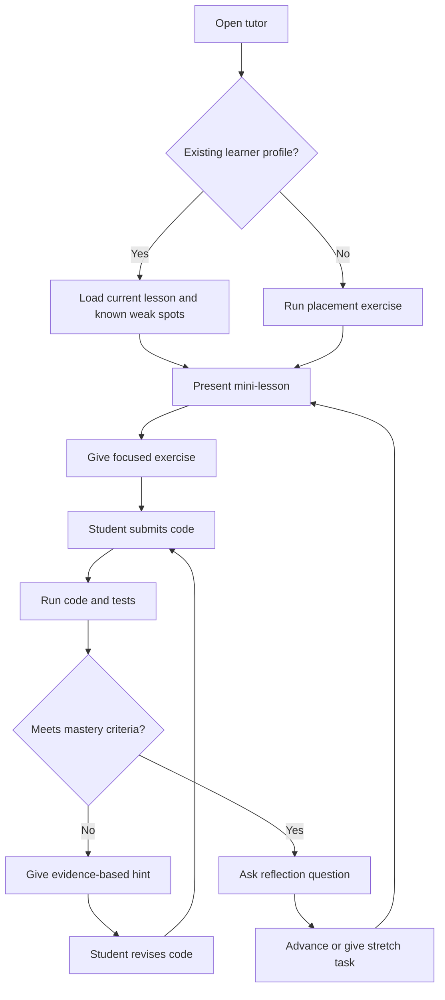
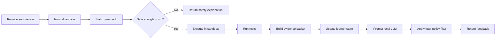

# Workflow

This document describes the learner workflow and the internal application workflow.

## Learner Workflow



## Internal Workflow



## Evidence Packet

The orchestrator should build a compact evidence packet before calling the LLM.

```yaml
lesson_id: loops.counting
exercise_id: count_even_numbers
student_code: |
  for n in numbers:
      if n % 2 == 0:
          count + 1
stdout: ""
stderr: ""
return_code: 0
tests:
  passed: 1
  failed: 2
failures:
  - test_name: counts_multiple_even_numbers
    expected: 3
    actual: 0
static_notes:
  - expression "count + 1" does not assign back to count
learner_profile:
  recurring_errors:
    - mutation_vs_expression
hint_policy:
  max_hint_level: 2
  do_not_provide_full_solution: true
```

## Feedback Ladder

The tutor should expose a controlled hint ladder.

| Level | Behavior | Example |
|---|---|---|
| 0 | Ask a diagnostic question | "What value should change inside the loop?" |
| 1 | Point to the region | "Look at the line where you add 1." |
| 2 | Name the concept | "In Python, `count + 1` computes a value but does not store it." |
| 3 | Show a small pattern | "The update shape is `name = name + amount` or `name += amount`." |
| 4 | Provide full solution | Only after explicit request or repeated failed attempts. |

## Session Loop

Each session should end with a short local summary:

```text
Today you practiced:
- for loops
- conditional checks
- updating counters

Still fragile:
- assignment versus expression

Next recommended exercise:
- count words longer than five characters
```

## Instructor Mode

An optional instructor mode can generate lesson plans, review progress, and create new exercises. It should not weaken the sandbox or expose hidden tests to the learner.
